# UserInteraction
Simple User Interaction using Android Java

1. Tampilan awal user interface: ada edittext, spinner, button dan textview. Saat edit text diklik maka akan muncul keyboard angka karena inputtypenya adalah phone
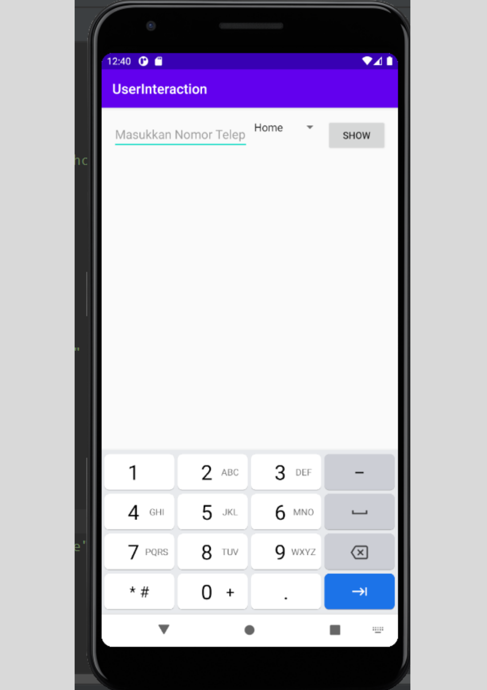

2. Pilihan spinner yang bisa dipilih oleh user
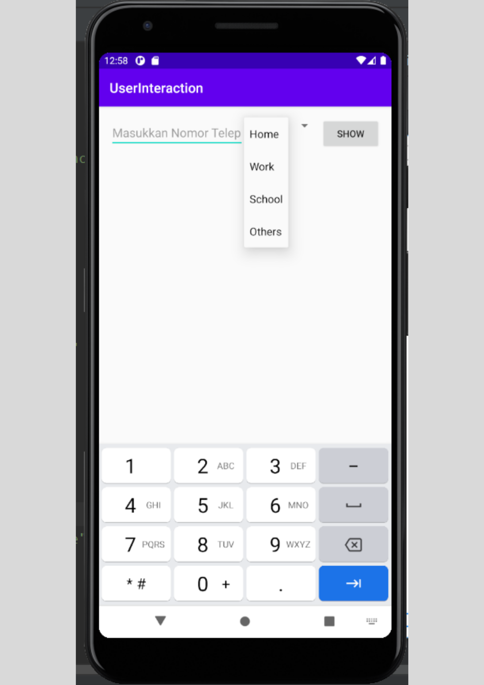

3. Saat mengetikkan edittext berupa nomor hp dan memilih pilihan dari spinnernya, maka setelah dijalankan akan menghasilkan output di textview paling bawah
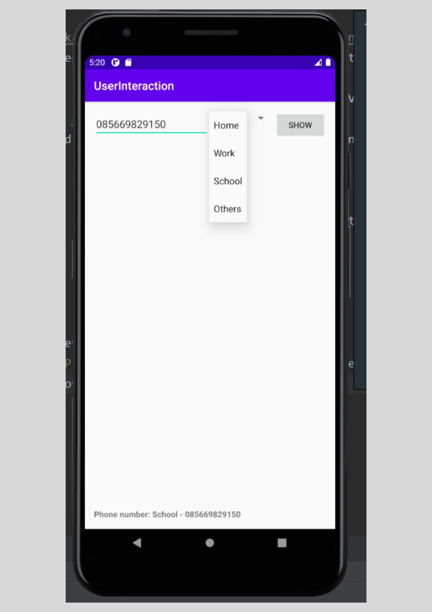

4. Ada radio group dan begitu dipilih maka alert akan muncul
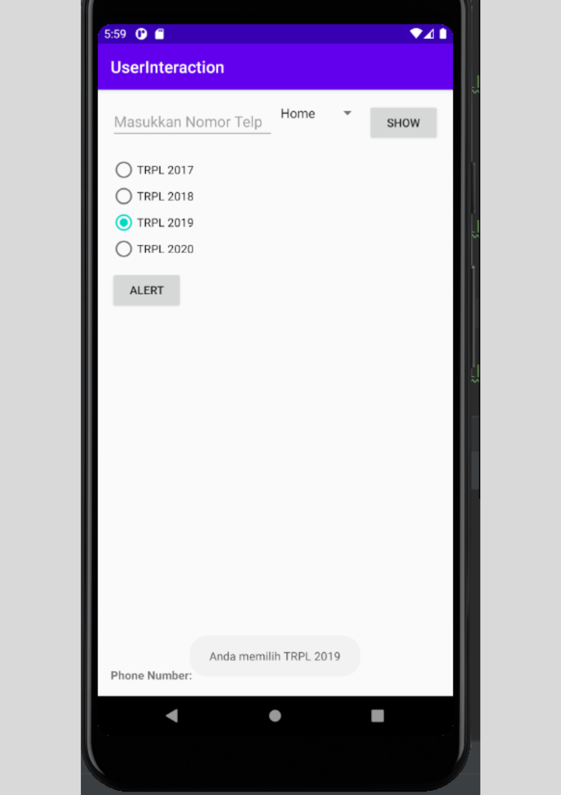

5. Ketika klik alert, maka alert akan muncul untuk milih "Next" atau "Quit"
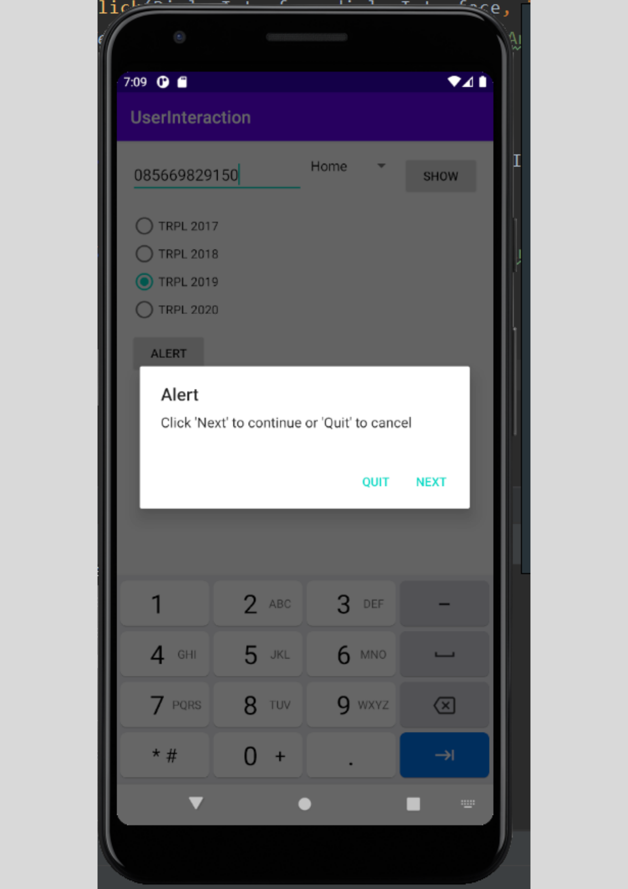

6. Pesan alert saat memilih Next
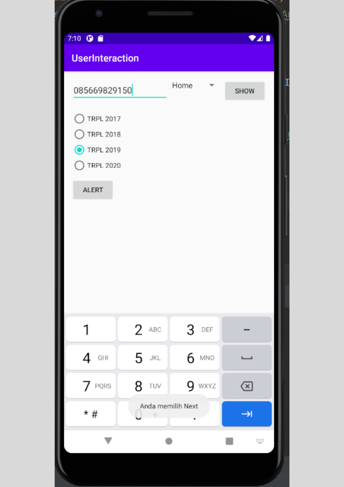

7. Pesan alert saat memilih quit
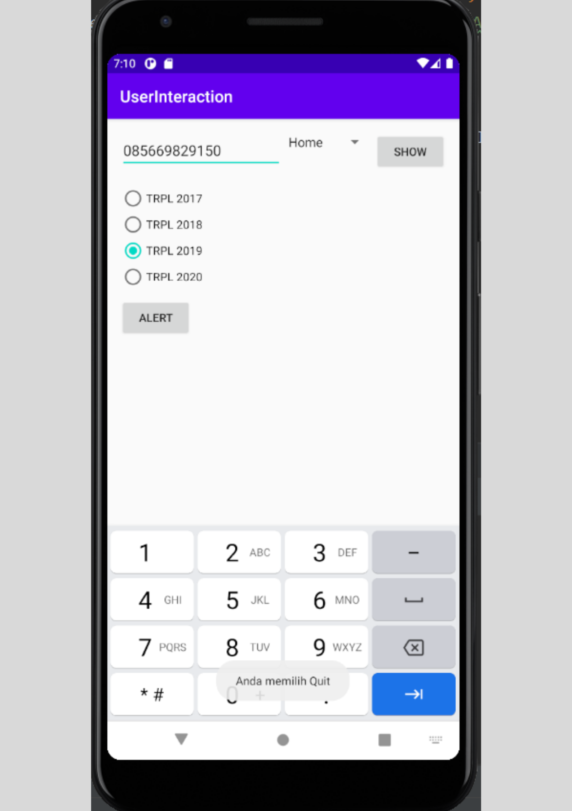

8. Selanjutnya ada dropdown menu item. Saya buat 3 menu. Yang pertama menu yang saya jadikan show as actionnya "always" sehingga muncul di title bar aplikasi
dan menggunakan icon "search", saat diklik icon tersebut maka akan muncul alert
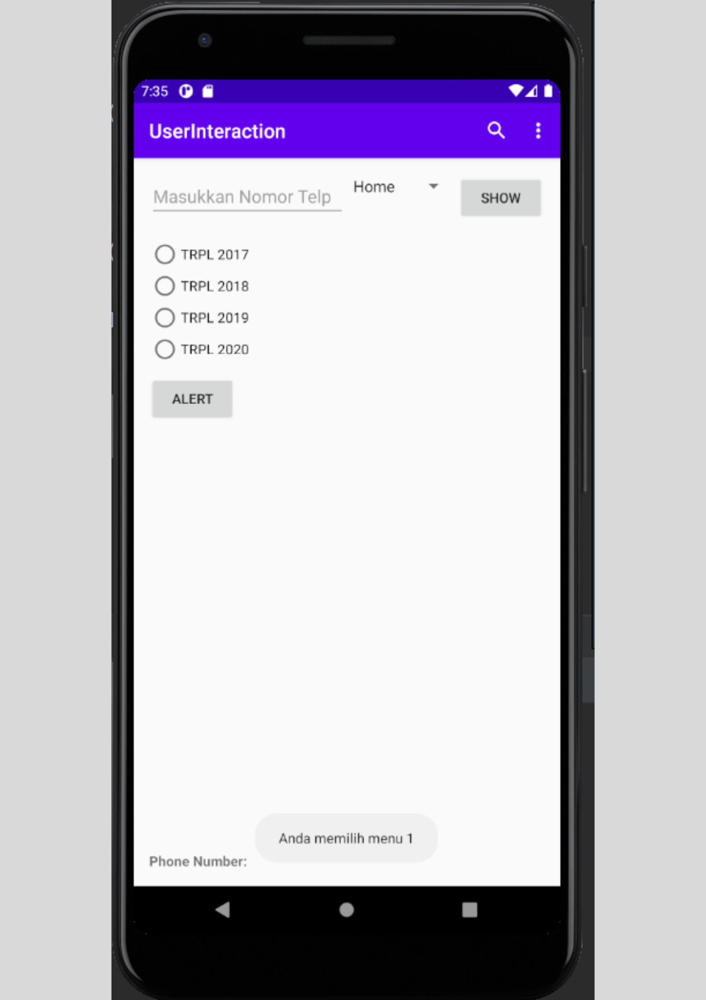

9. Ini adalah tampilan menu item yang kedua dan ketiga. karena tidak dijadikan always, maka tampilannya akan seperti ini. Dan ini saya atur order in categorynya,
semakin kecil angkanya maka menu item akan tampil paling atas
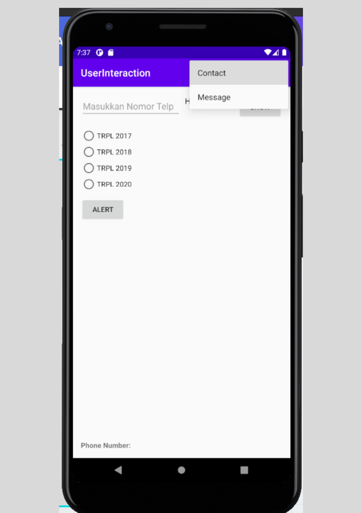

10. Saat menu item "Contact" diklik, maka akan muncul alert
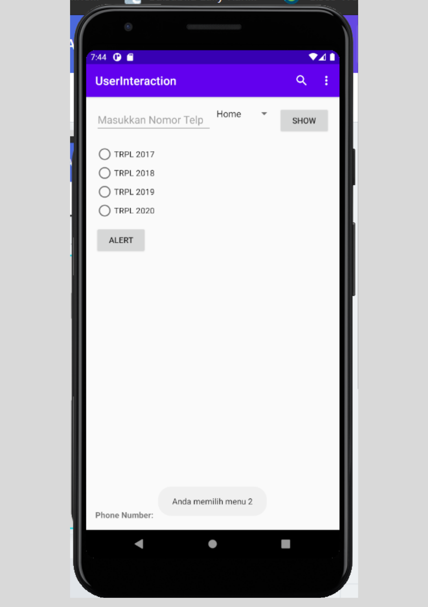

11. Saat menu item "Message" diklik, maka akan muncul alert
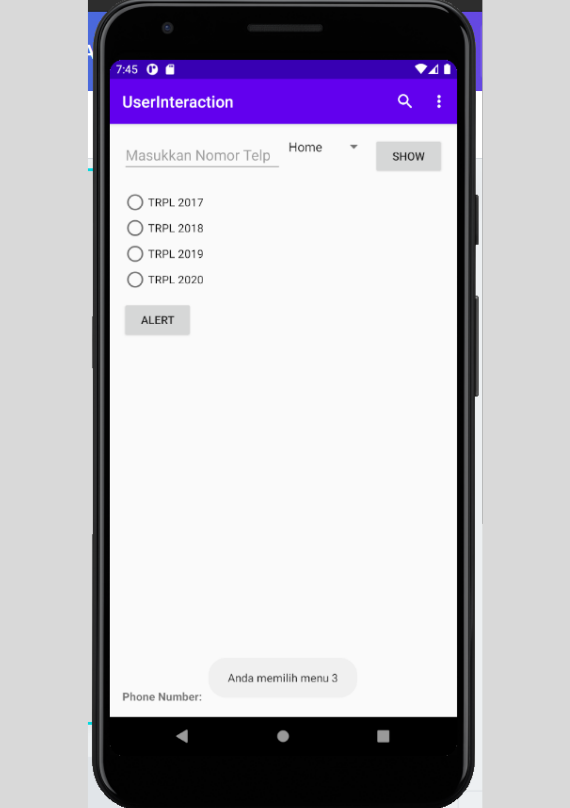

-FINISH-
